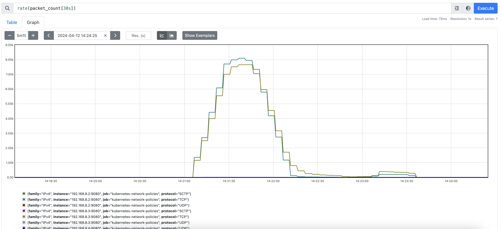

# Testing

This is an example of how to do some microbenchmarking.

1. Collect the existing metrics from the agents
   
Example [deployment with prometheus](./monitoring.yaml)

2. Deploy some Pods running an http server behind a Service

Since network policies work for the first packet in the connection we need to generate new connections:
* We can not use HTTP keepalives or HTTP2 or protocols that multiplex request over the same connection
* A pair of endpoints will be limited by the number of ephemeral ports in the origin, since the destination IP and Port will be fixed 

```
cat /proc/sys/net/ipv4/ip_local_port_range
32768   60999
```

3. Run a [Job that polls the Service created previously](job_poller.yaml)

Each Pod runs request in parallel

```
 kubectl logs abtest-t7wjd
This is ApacheBench, Version 2.3 <$Revision: 1913912 $>
Copyright 1996 Adam Twiss, Zeus Technology Ltd, http://www.zeustech.net/
Licensed to The Apache Software Foundation, http://www.apache.org/

Benchmarking test-service (be patient)
Completed 1000 requests
Completed 2000 requests
Completed 3000 requests
Completed 4000 requests
Completed 5000 requests
Completed 6000 requests
Completed 7000 requests
Completed 8000 requests
Completed 9000 requests
Completed 10000 requests
Finished 10000 requests


Server Software:
Server Hostname:        test-service
Server Port:            80

Document Path:          /
Document Length:        60 bytes

Concurrency Level:      1000
Time taken for tests:   4.317 seconds
Complete requests:      10000
Failed requests:        1274
   (Connect: 0, Receive: 0, Length: 1274, Exceptions: 0)
Total transferred:      1768597 bytes
HTML transferred:       598597 bytes
Requests per second:    2316.61 [#/sec] (mean)
Time per request:       431.666 [ms] (mean)
Time per request:       0.432 [ms] (mean, across all concurrent requests)
Transfer rate:          400.11 [Kbytes/sec] received

Connection Times (ms)
              min  mean[+/-sd] median   max
Connect:        0  188 571.9      4    4121
Processing:     0    2   5.3      0      42
Waiting:        0    1   2.8      0      32
Total:          0  190 571.8      5    4122

Percentage of the requests served within a certain time (ms)
  50%      5
  66%      7
  75%     22
  80%     24
  90%   1023
  95%   1046
  98%   2063
  99%   3080
 100%   4122 (longest request)
 ```

 You have to tune your system as it is most likely you reach limits in some of the different resources, specially in the conntrack table

 ```
 [1825525.815672] net_ratelimit: 411 callbacks suppressed
[1825525.815676] nf_conntrack: nf_conntrack: table full, dropping packet
[1825525.827617] nf_conntrack: nf_conntrack: table full, dropping packet
[1825525.834317] nf_conntrack: nf_conntrack: table full, dropping packet
[1825525.841058] nf_conntrack: nf_conntrack: table full, dropping packet
[1825525.847764] nf_conntrack: nf_conntrack: table full, dropping packet
[1825525.854458] nf_conntrack: nf_conntrack: table full, dropping packet
[1825525.861131] nf_conntrack: nf_conntrack: table full, dropping packet
[1825525.867814] nf_conntrack: nf_conntrack: table full, dropping packet
[1825525.874505] nf_conntrack: nf_conntrack: table full, dropping packet
[1825525.881186] nf_conntrack: nf_conntrack: table full, dropping packet
```

Check the current max number of conntrack entries allowed and tune accordenly

```
 cat /proc/sys/net/netfilter/nf_conntrack_max
262144
```


4. Observe the metrics in prometheus or graphana





## Future work

We are interested in understanding the following variables

* Memory and CPU consumption
* Latency on packet processing
* Latency to apply a network policy since it has been created

This can microbencharked easily, using one Node or a Kind cluster and adding fake nodes and pods https://developer.ibm.com/tutorials/awb-using-kwok-to-simulate-a-large-kubernetes-openshift-cluster/ and running scenarios in just one node with the different variables


Inputs:

* New connections per seconds
* Number of Pods on the cluster (affected or not affected by network policies)
* Number of Network Policies impacting the connections
